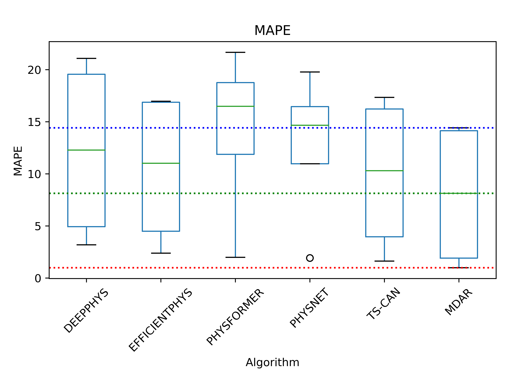

---

# Non-Contact Heart Rate Detection Method

This project has developed an innovative remote Photoplethysmography (rPPG) method that allows for the remote monitoring of human heart rates using a camera. Our method has been tested on multiple datasets, including UBFC, PURE, and MMPD, demonstrating excellent accuracy and robustness.

## Key Features

- **Non-contact Heart Rate Detection**: Utilizes a camera to capture subtle color changes in the face to calculate heart rate.
- **High Accuracy**: Achieved great results on the UBFC, PURE, and MMPD datasets.
- **Real-Time Monitoring**: The system can process video streams in real-time and output heart rate results.

## Results Showcase

Below are the heart rate detection results on the UBFC and PURE MMPD datasets.


*UBFC Dataset Results*


## How to Run

### Run the Project

To run this project, ensure you have installed all dependencies, and you can directly run the following command:

```bash
python main.py --config_file rppg_MDAR/TS-CAN-v1/PURE_PURE_UBFC-PHYS_TSCAN_BASIC.yaml
```

### Running Configuration Files

We provide configuration files to facilitate running experiments and replicating results. You can specify a configuration file to run an experiment with the following command:

```bash
cd rppg_MDAR/TS-CAN-v1
ls
```

---


---

# 隔空心率检测方法

本项目开发了一种创新的远程光电容积描记图（rPPG）方法，可以通过摄像头远程监测人体心率。我们的方法在多个数据集上进行了测试，包括UBFC、PURE和MMPD，展示了出色的准确性和鲁棒性。

## 主要特点

- **非接触式心率检测**：利用摄像头捕捉面部微小的颜色变化，计算心率。
- **高准确度**：在UBFC、PURE和MMPD数据集上获得了很好的效果。
- **实时监测**：系统能够实时处理视频流并输出心率结果。

## 结果展示

以下是在UBFC和PURE MMPD数据集上的心率检测效果展示。


*UBFC 数据集结果*


## 如何运行

### 运行项目

要运行本项目，请确保您已经安装了所有依赖，并且可以直接运行以下命令：

```bash
python main.py --config_file rppg_MDAR/TS-CAN-v1/PURE_PURE_UBFC-PHYS_TSCAN_BASIC.yaml
```

### 运行配置文件

我们提供了配置文件，以方便运行实验和复现结果。您可以通过以下命令指定配置文件运行实验：

```bash
cd rppg_MDAR/TS-CAN-v1
ls
```

# rPPG-MDAR
